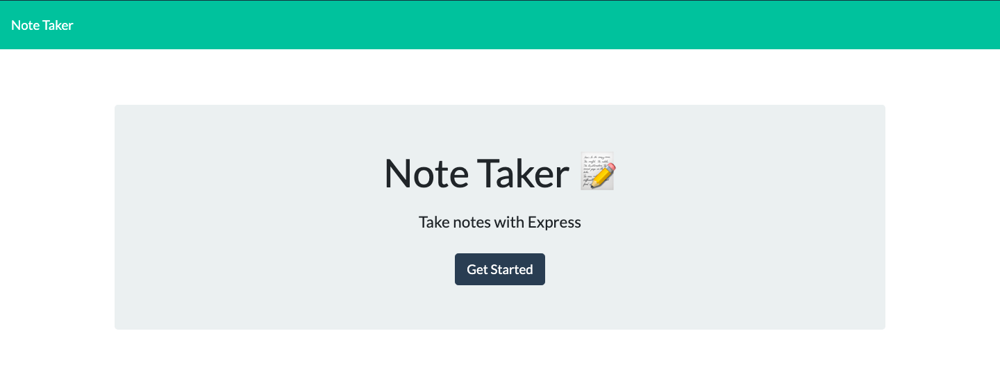
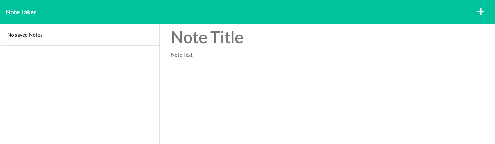
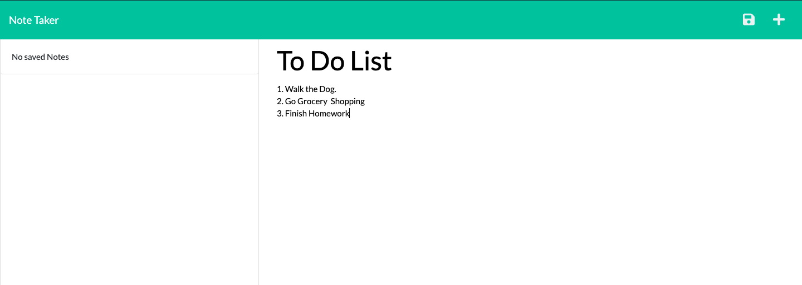
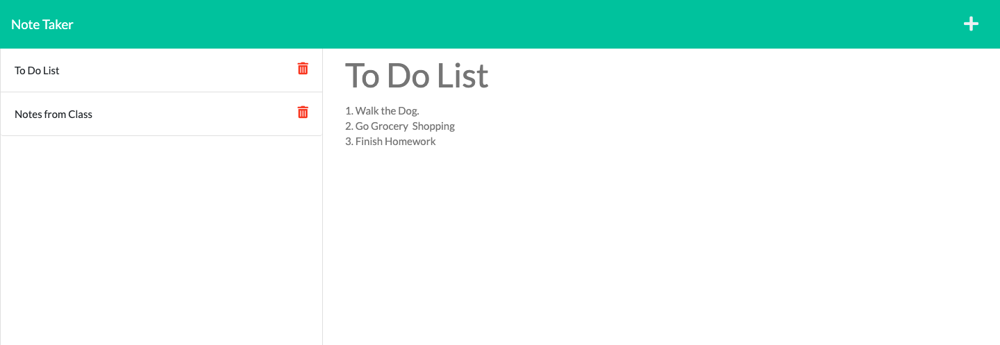

# 11. Express.js Challenge: Note Taker

## Description

Welcome to my note taker! Written with Node.js, this application takes advantage of the Express npm package to create a backend server that connects with the front end HTML user interface. As a full stack application, the notes you create are saved on the server and persist between sessions.

## Table of Contents

* [Deployment](#deployment)
* [Usage](#usage)
* [License](#license)
* [Credits](#credits)
* [Authors](#authors)
* [Questions](#questions)

## Deployment

You can view the live site [here](https://amato-note-taker.herokuapp.com/).

## Usage

After clicking the above link to the deployed application, click "Get Started". This will bring you to the application's main page.

Now you can start writing your first note! When you've finished simply click the save icon in the top right of the screen to save your note to the server.

You can add a new note by clicking the add button in the top right corner. To view a note you already wrote, simply click that note from the list on the left hand side of your screen. You can also a note by pressing the delete icon on that note in the list.

## License

[MIT](./LICENSE.txt)

## Credits

3rd Party Dependencies

* [Express](https://expressjs.com/)

Starter Code

* [UCF Coding Bootcamp](https://github.com/coding-boot-camp/miniature-eureka)

## Authors

Aidan Amato

## Questions

Please reach out of you have any additional questions!

* [GitHub](https://github.com/aidanamato)
* [Email](mailto:aidanamato@comcast.net)
